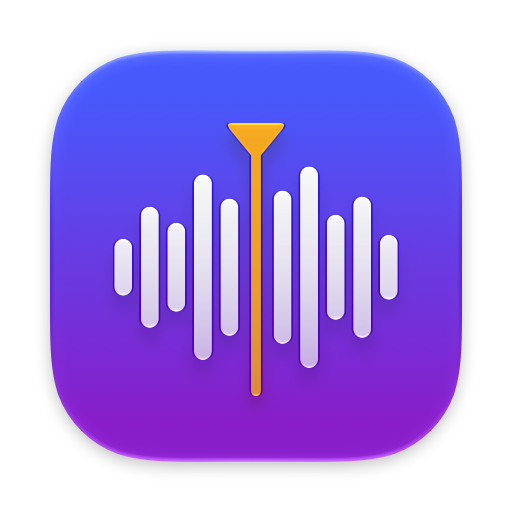

<p align="center"></p>

# trackcut

A macOS app for splitting a long recording (a live set, a ripped album, a radio show) into one file per track while looking at the waveform. It reads FLAC, M4A and WAV, and writes each track as its own file with tags.

The user interface is in English and Japanese and follows the system language. To use the other one, choose it in TrackCut > Settings (⌘,) and relaunch the app. The setting is the same one as TrackCut's entry in System Settings > General > Language & Region > Applications.

## Features

- Open FLAC / M4A (AAC, ALAC) / WAV files from the Open dialog (⌘O), by dropping them on the window, or with "Open With" in Finder
- Join several files into one recording: choose several files or a folder, and add, reorder or remove files later (see [Joining files](#joining-files))
- See the source file's format in the inspector: codec, sample rate, bit depth, channels, bit rate, length and file size
- Save the work as a project (⌘S) and pick it up again later (see [Projects](#projects))
- Two waveform views: an overview of the whole file and a zoomable detail view with a time ruler
- Place split points by double-clicking the waveform, pressing `M` at the playhead, or from the context menu; drag them to adjust
- Detect split points automatically from silent gaps, with an adjustable threshold (dB) and minimum gap length
- Fade each track in at its start and out at its end, with a choice of curve (linear, equal power, S-curve, exponential). The waveform shows the result as it will be exported
- Name each track, choose which tracks to export, and set an artist per track
- Undo and redo every edit (⌘Z / ⇧⌘Z). Typing into a text field becomes one step when the field finishes editing
- Export every track to its own file named `01 Title.ext`. Tracks left out of the export leave no gap in the numbers: with track 2 unchecked, track 3 is exported as `02`. The track list shows the number each track is exported under
- On macOS 26 and later the window uses Liquid Glass: glass toolbar groups, floating playback controls over the waveform and a glass inspector

### Export formats

- **Same as source** (default): the source's format, bit depth and sample rate
  - WAV, FLAC and ALAC keep the source bit depth
  - AAC is cut without re-encoding, except for tracks with a fade, which are re-encoded at about the source's bit rate
- **WAV**, **FLAC**, **Apple Lossless (m4a)**: bit depth (same as source, 16 or 24 bit) and sample rate (same as source, 44.1 to 192 kHz)
- **AAC (m4a)**: bit rate (96 to 320 kbps, 256 kbps by default) and sample rate (same as source, 44.1 or 48 kHz). AAC goes up to 48 kHz, so a source above that is converted to 44.1 kHz if it is a multiple of it (88.2, 176.4 kHz) and to 48 kHz otherwise. An AAC source is re-encoded at the chosen bit rate; use "Same as source" to cut it without re-encoding

A different sample rate is converted with Core Audio's highest-quality sample rate converter. The choices are kept for the next export.

### Tags

Exported files get the title, track number and total, artist, album, album artist, year and genre. Album-wide fields are prefilled from the source file's tags when it has any.

- **FLAC**: Vorbis comment
- **M4A**: iTunes metadata
- **WAV**: LIST/INFO chunk. INFO has no field for the album artist or the track total, so those two are not written

### Joining files

Choosing several audio files at once, or a folder, in the Open dialog (or dropping them on the window or the Dock icon) joins them into one recording. A folder contributes the FLAC, M4A and WAV files directly inside it, not those in subfolders. Before they are joined, the files are listed in the order Finder shows them, so you can drag them into another order or leave some out.

The joined recording starts with a split point where each file starts, one track per file, named after the file's title tag (or its file name without a leading track number). Album fields that all files agree on are filled in, and each track gets its file's artist where they differ. From there it is edited like any other recording: move, add or remove split points to cut a track across two files, or merge files into one track.

Files can be added, reordered and removed after the recording is open. File > Add Files… (⌥⌘O) adds files or folders at the end; File > Arrange Files… (also in the inspector) lists the files to drag into another order, add to with + (after the selected file) or by dragging files in from Finder, and leave out with −. Tracks move with the file they start in, so each track keeps its audio. Where two files are no longer next to each other, a track running from one into the other is split where the second file starts; the tracks of a removed file are removed, and each added file gets a track of its own. Each change is one step that ⌘Z undoes. Waveforms are kept per file, so only added files are analyzed.

Files may have different formats. The recording takes the highest sample rate and channel count among them, and files that differ are converted as they are read (a mono file plays on both channels). Files at the recording's sample rate are read sample for sample, even when their channels are mapped. With "Same as source", the export takes the first file's codec, the highest bit depth among the lossless files, and the recording's sample rate and channel count. It is floating point when any of the files is; when one of the others is an integer file deeper than 24 bits, it is 64-bit float, which holds both exactly (and takes twice the space of 32-bit). An AAC track that lies within one AAC file is still cut without re-encoding.

### Projects

File > Save Project (⌘S) saves the split points, titles, artists, export selection, fades and album tags to a `.trackcut` file, and Open (⌘O) or a double-click in Finder opens it again. A project refers to the audio files rather than containing them. It records both each file's path and its path relative to the project, so they can be moved together; if an audio file cannot be found, TrackCut asks where it is.

Opening another file or quitting with unsaved changes asks whether to save them first.

The file is JSON:

```json
{
  "album" : { "album" : "Live at the Hall", "artist" : "Band", ... },
  "sources" : [ { "path" : "/Users/me/Music/audio/live.flac", "relativePath" : "audio/live.flac" } ],
  "tracks" : [ { "start" : 0, "title" : "Intro", "isEnabled" : true, "fadeIn" : { "duration" : 1.5, "curve" : "sCurve" }, ... } ],
  "version" : 1
}
```

## Install

On an Apple silicon Mac with macOS 15 or later, install it with [Homebrew](https://brew.sh):

```sh
brew install --cask tamura09/tap/trackcut
```

or download `TrackCut-<version>-arm64.zip` from [Releases](https://github.com/tamura09/trackcut/releases).

The app is ad-hoc signed and not notarized, so macOS blocks it the first time. After the first attempt to open it, go to System Settings > Privacy & Security and choose "Open Anyway".

On an Intel Mac, build it from source as described below.

### Updates

TrackCut checks for a new version once a day, and on demand with TrackCut > Check for Updates…. It shows the release notes, then downloads, installs and relaunches the new version with [Sparkle](https://sparkle-project.org). Every update is checked against the project's EdDSA signature before it is installed.

Version 0.1.0 does not have the updater. Replace it once by hand: download the latest release again, or run `brew upgrade --cask --greedy trackcut`.

## Requirements

- Running: macOS 15 or later
- Building: Xcode 26 or later. The app uses the Liquid Glass APIs from the macOS 26 SDK; on older systems it checks at run time and falls back, but older SDKs cannot compile it. `swift build` and `swift test` also work with just the Command Line Tools, but `build-app.sh` needs Xcode for `actool`, which compiles the app icon

## Build and run

```sh
./build-app.sh
open build/TrackCut.app
```

`build-app.sh` builds a release binary with SwiftPM, wraps it in an app bundle with an `Info.plist` (so Finder can open audio files, `.trackcut` projects and folders with it), the app icon and Sparkle.framework, and signs it ad hoc. The bundle's version is `TRACKCUT_VERSION` if set, otherwise the latest `v*` tag.

During development you can also run it straight from SwiftPM:

```sh
swift run TrackCut
```

A binary built this way shows the pre-Liquid Glass design: SwiftPM records the deployment target (macOS 15) as the SDK version, and AppKit picks the design from it. `build-app.sh` passes the SDK to the link step so the bundle gets the current design. It is also English only, since the translations are copied into the app bundle by `build-app.sh`.

## Usage

### Mouse and trackpad

- Click: move the playhead and select the track under it
- Drag: scrub
- Double-click: add a split point
- Drag a split point: move it
- Drag the round handles at the top of the selected track: set the length of its fade-in and fade-out. Where the two fades meet, the handles overlap: drag left to shorten the fade-in, right to shorten the fade-out
- Right-click: add or delete a split point, fade in up to / out from the clicked point, remove a fade, or include / exclude the track from the export
- Scroll: pan
- ⌘ or ⌥ + scroll, or pinch: zoom
- Click or drag in the overview: move the visible range

### Inspector

The inspector on the right (⌥⌘I) edits the selected track: title, artist, whether to export it, and the length and curve of its fades. "Apply these fades to all tracks" copies its fades to every track; on a track too short for both, they are shortened in proportion. Below them are the album-wide tags, then the source file's format (one row per file for joined files) with buttons to add and arrange files.

### Keyboard

Single-key shortcuts work anywhere in the window except while typing in a text field. Help > Keyboard Shortcuts (⌘/) lists them all.

- `Space`: play / pause
- `←` / `→`: move the playhead 1 second (with `⇧`: 10 seconds)
- `↑` / `↓`: previous / next track
- `Home` / `End`: start / end of the file
- `M`: split at the playhead
- `Delete`: remove the split point at the start of the selected track
- `,` / `.`: move that split point 10 ms earlier / later (with `⇧`: 100 ms)
- `E`: include / exclude the selected track from the export
- `I`: fade in from the start of the track to the playhead
- `O`: fade out from the playhead to the end of the track
- `⇧I` / `⇧O`: remove the fade-in / fade-out
- `=` / `-`: zoom in / out
- `Z`: zoom to the selected track; `⇧Z`: show the whole file

Menu shortcuts: ⌘O open, ⌥⌘O add files, ⌘S / ⇧⌘S save project / save project as, ⌘E export, ⇧⌘D split at silences, ⌘Z / ⇧⌘Z undo / redo, ⌘= / ⌘- / ⌘0 zoom in / out / fit, ⌥⌘I inspector.

## Development

The project is a Swift package with two targets.

- `TrackCutCore`: waveform analysis, silence detection, fades, export and tag reading/writing. No UI code
- `TrackCut`: the SwiftUI / AppKit app

Run the tests with:

```sh
swift test
```

- `TrackCutCoreTests`: analysis, silence detection, fades, export and tags
- `TrackCutTests`: the app's editing, undo, mouse handling of the waveform and keyboard shortcuts. They drive `EditorModel` and the waveform view directly, with synthesized events in windows that are never shown

`build-app.sh` also checks that the binary records SDK 26 or later, which the Liquid Glass design depends on.

With only the Command Line Tools installed (no Xcode), the Swift Testing macro plugin is not found by default. Pass its path explicitly:

```sh
swift test -Xswiftc -plugin-path -Xswiftc /Library/Developer/CommandLineTools/usr/lib/swift/host/plugins/testing
```

For the same reason, the app avoids the `@State` macro and keeps view state in `ObservableObject`s, so it builds with either toolchain.

The app icon is `AppIcon.icon`, an Icon Composer file: open it in Icon Composer (Xcode > Open Developer Tool) to edit it. `build-app.sh` compiles it with `actool` into `Assets.car`, which macOS 26 and later draw with Liquid Glass, and `AppIcon.icns` for macOS 15. `docs/icon.png`, shown at the top of this README, is a render of the built app's icon; update it along with the icon.

### Localization

The strings in the code are the English text, and they double as the keys of the translations in `Localizations/`:

- `ja.lproj/Localizable.strings`: the Japanese translation of every string without a count
- `ja.lproj/Localizable.stringsdict` and `en.lproj/Localizable.stringsdict`: the strings that contain a count. English needs a singular form; Japanese has a single form, but is kept here too, since a `.stringsdict` in another language can take precedence over this language's `.strings`

Pass user-facing text to a SwiftUI view as a literal, or wrap it in `String(localized:)` where the API takes a plain `String` (AppKit, error messages, undo action names). Then run:

```sh
./check-localizations.sh
```

It lists every localizable string the compiler sees and fails when one has no Japanese translation, or when a table has a key the code no longer uses. CI runs it on every pull request.

## Releasing

```sh
./release.sh 0.2.0 notes.md
```

`release.sh` builds the bundle at that version, zips it, signs the zip and an `appcast.xml` feed with the Sparkle EdDSA key, and after a confirmation creates the `v0.2.0` release on GitHub with both attached. It releases only a clean checkout of `origin/main`, and only a version newer than the latest release. The Markdown in `notes.md` becomes the release body and the notes shown in the update dialog. `--no-publish` stops after writing the files to `build/`.

The app reads the feed from `releases/latest/download/appcast.xml`, so publishing the release is what offers it to users. Afterwards, bump `version` and `sha256` in the Homebrew cask; the script prints both.

The private key is in the maintainer's login Keychain under the account `com.9tmr.TrackCut`; its public half is `SUPublicEDKey` in `build-app.sh`. Without it no further update can be shipped to existing installs, so keep a backup (`.build/artifacts/sparkle/Sparkle/bin/generate_keys --account com.9tmr.TrackCut -x <file>`) somewhere safe. On another Mac, import it with `-f <file>`.
